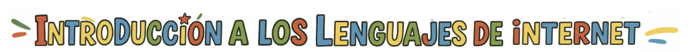
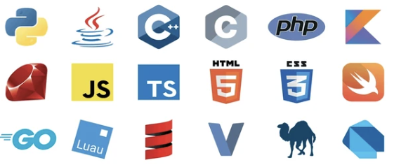
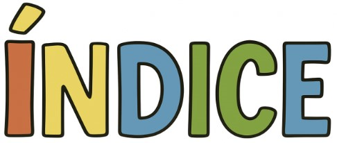
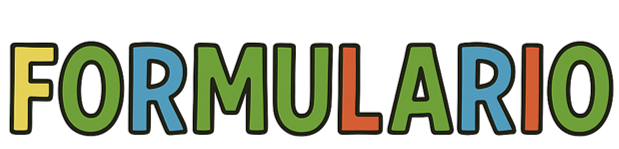
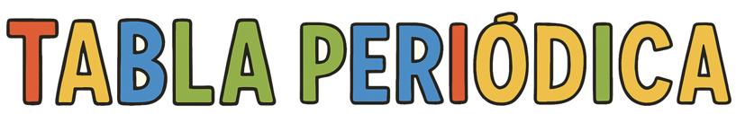
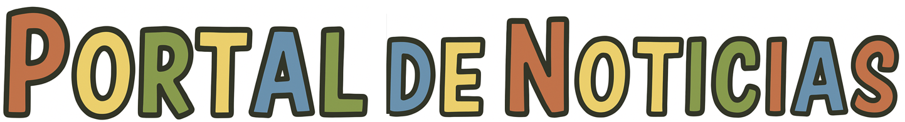
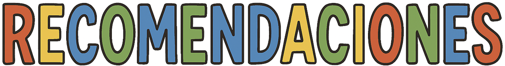
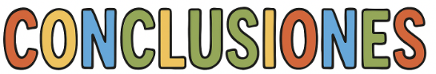
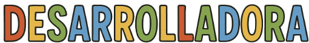

#  

  <table border="0">
    <tr>
      <td valign="little">
        <h2>Proyectos para la asignatura de Introducción a los lenguajes de internet</h2>
      </td>
      <td>
        
      </td>
    </tr>
  </table>

Este repositorio tiene como propósito centralizar todos los trabajos desarrollados durante la asignatura Introducción a los Lenguajes de Internet.
Cada proyecto se encuentra en un repositorio independiente para facilitar su organización y desarrollo. A continuación, se presentan los enlaces que dirigen a cada uno de ellos:

---

- [Formulario](#formulario)
- [Tabla periódica](#tabla-periódica)
- [Portal de noticias](#portal-de-noticias)
- [Recomendaciones](#recomendaciones)  
- [Conclusiones](#conclusiones)
- [Desarrolladora](#desarrolladora)

---

Este proyecto corresponde al desarrollo de un formulario para un gimnasio, en el cual se trabajará de manera progresiva desde su versión inicial hasta su versión final. Aquí se podrá observar cómo el formulario evoluciona en diseño y funcionalidad a medida que se aplican los conceptos aprendidos en clase.

👉 Ir al repositorio del Formulario https://github.com/JohanaS77/Formulario-Gym

[🔼 Volver al índice](#índice)

---

Este proyecto fue desarrollado con el objetivo principal es representar la tabla periódica de los elementos químicos utilizando herramientas básicas de desarrollo web (HTML, CSS y JavaScript).
Con este trabajo busco poner en práctica los conceptos aprendidos en clase sobre estructuración de información, diseño con estilos y manejo de interactividad en páginas web.

👉 Acceder al repositorio del proyecto Tabla Periódica: https://github.com/JohanaS77/Tabla-Periodica

[🔼 Volver al índice](#índice)

---

Este proyecto se desarrolló como parte de la asignatura <strong>Introducción a los Lenguajes de Internet</strong>, teniendo como propósito aplicar de manera integrada los conceptos aprendidos durante el curso en <strong>HTML, CSS y JavaScript</strong>.  
El trabajo consiste en la construcción de un <strong>portal de noticias</strong> que combina una estructura semántica adecuada, el diseño responsivo de interfaces y la incorporación de interactividad mediante modales.  
A través de este proyecto se refuerzan competencias clave en <strong>diseño web, usabilidad y programación front-end</strong>, consolidando los aprendizajes obtenidos en clase y evidenciando el progreso en el desarrollo de aplicaciones web.   

👉 Ir al repositorio del Portal de Noticias: https://github.com/JohanaS77/portal-noticias/tree/main  

[🔼 Volver al índice](#índice)  

---

Para acceder a cada proyecto desarrollado durante el semestre, es importante dar clic en el enlace correspondiente. Cada enlace redirige directamente al repositorio individual del proyecto, donde se podrá consultar su desarrollo completo y las actualizaciones realizadas en cada etapa.

[🔼 Volver al índice](#índice)

---

[🔼 Volver al índice](#índice)

---

Este proyecto fue desarrollado por <strong>Johana Jazmín Saavedra</strong>, estudiante de cuarto semestre en <strong>Técnica profesional en programación de aplicaciones de software</strong> de la <strong>Fundación Universitaria Compensar</strong>. Con una participación activa en la creación y desarrollo del proyecto.

  
   
  <strong>Johana Jazmín Saavedra</strong>

[🔼 Volver al índice](#índice)

---
